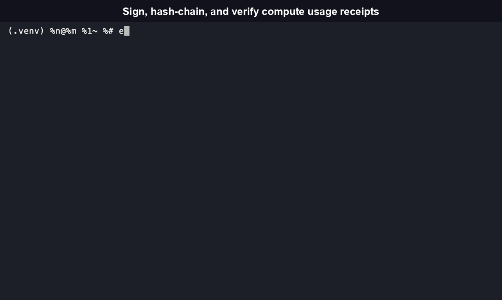
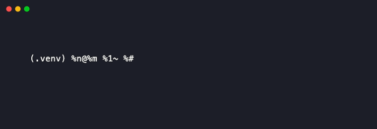

# ComputeLedger

**Sign, hash-chain, and independently verify compute usage, portable across any provider.**

ComputeLedger records a compute job's usage (GPU-hours, hardware, duration, workload type) as a cryptographically signed receipt and appends it to a tamper-evident local ledger. Anyone can verify a receipt's authenticity and the ledger's integrity without trusting the issuer, and without buying into any single cloud, chain, or vendor's stack.

[](https://github.com/RudrenduPaul/ComputeLedger/actions/workflows/ci.yml)
[](https://www.npmjs.com/package/computeledger-cli)
[](https://pypi.org/project/computeledger-cli/)
[](LICENSE)
[](package.json)

## Install

```bash
npm install -g computeledger-cli
```

```bash
pip install computeledger-cli
```

Both packages install the same `computeledger` command. Receipts are interoperable either way: a receipt signed by the npm binary verifies correctly with the PyPI binary, and vice versa.

## Demo



## Table of contents

- [Quickstart](#quickstart)
- [Why this exists](#why-this-exists)
- [Features](#features)
- [CLI reference](#cli-reference)
- [MCP / agent-native usage](#mcp--agent-native-usage)
- [Library API](#library-api)
- [Comparison](#comparison)
- [What is ComputeLedger, and why does it exist](#what-is-computeledger-and-why-does-it-exist)
- [FAQ](#faq)
- [Contributing](#contributing)
- [License](#license)

## Quickstart

```bash
$ computeledger keys generate --local
Generated Ed25519 keypair.
Public key: COxK/lkoWxWB42QKXjvcHnmBPozH4Oo2JHoOKDjsoU8=
Private key: ./.computeledger/keys/ed25519.pem (mode 600)

$ computeledger record --local --provider aws --hardware nvidia-h100 \
    --duration-seconds 3600 --gpu-hours 1 --workload-type training
Recorded usage receipt 39952199-0897-48b8-92c5-e351f773c83d.

$ computeledger ledger verify --local
Ledger valid: 1 entries, unbroken hash chain.
```

Or wrap a real job directly, no manual `record` call needed:

```bash
computeledger run --local --provider on-prem --hardware nvidia-a100 -- python train.py
```

`run` executes the wrapped command as a real subprocess (never through a shell), measures wall-clock duration, samples GPU utilization via `nvidia-smi` when one is present, and signs + appends the resulting receipt automatically. On a machine with no NVIDIA GPU, it still produces a duration-only receipt.


Give the receipt to anyone, on any machine, with no ComputeLedger account and no network call:

```bash
computeledger verify receipt.json
```

## Why this exists

Multi-cloud and multi-provider GPU usage has no portable, verifiable record. A cost dashboard tells you what a provider says you used; it does not let a third party independently confirm that record wasn't altered after the fact, and it only works with the providers it integrates with. ComputeLedger is a lightweight, provider-agnostic attestation format: any process that can run a CLI command or call an MCP tool can produce a receipt, and any process, in any language, can verify one.

This is deliberately narrow. It does not compete with GPU marketplaces, cost dashboards, or confidential-computing platforms, all of which do real, different jobs. See the comparison below for exactly where the line is.

## Features

- **Ed25519 signatures via Node's and Python's built-in/standard crypto libraries.** No bespoke cryptography, no external crypto dependency on the TypeScript side.
- **Hash-chained ledger.** Every receipt embeds the previous receipt's hash. Deleting, reordering, or editing a historical entry breaks the chain in a way `ledger verify` detects, even if the tampered entry's own signature still looks locally valid.
- **Cross-language interoperability by construction.** A receipt signed by the npm package's `computeledger` binary verifies correctly against the PyPI package's `computeledger` binary. Both implementations serialize the receipt payload through the same deterministic canonical-JSON algorithm before hashing.
- **Provider-agnostic.** No account, no API key, no dependency on any specific cloud or chain. Works identically on a laptop, an on-prem cluster, or any cloud VM.
- **Agent-native.** Every subcommand supports `--json` for structured output, and `computeledger mcp` starts a Model Context Protocol server exposing `record_usage`, `verify_receipt`, `list_ledger`, and `verify_ledger` as callable tools.
- **No shell-injection surface.** `computeledger run -- <command>` executes the wrapped command via an argument array, never a shell string, so metacharacters in the wrapped command are inert.

## CLI reference

```
computeledger keys generate [--local]
computeledger keys show [--local] [--json]
computeledger run [--local] [--provider <name>] [--hardware <type>] [--workload-type training|inference|unknown] [--no-record-command] [--json] -- <command...>
computeledger record --provider <name> --hardware <type> --duration-seconds <n> [--gpu-hours <n>] [--flops <n>] [--workload-type <type>] [--local] [--json]
computeledger verify <receipt.json> [--json]
computeledger ledger list [--local] [--json]
computeledger ledger show <id> [--local] [--json]
computeledger ledger verify [--local] [--json]
computeledger export --format json|csv [--out <file>] [--local]
computeledger mcp
```

| Flag | Meaning |
|---|---|
| `--local` | Use `./.computeledger` in the current directory instead of `~/.computeledger` |
| `--json` | Structured JSON on stdout instead of human-readable text |
| `--no-record-command` | Omit the wrapped command string from the receipt (`run` only) |



## MCP / agent-native usage

Add ComputeLedger as an MCP server (stdio transport):

```json
{
  "mcpServers": {
    "computeledger": {
      "command": "npx",
      "args": ["computeledger-cli", "mcp"]
    }
  }
}
```

Exposed tools: `record_usage(provider, hardware, durationSeconds, gpuHours?, estimatedFlops?, workloadType?, local?)`, `verify_receipt(receipt)`, `list_ledger(local?)`, `verify_ledger(local?)`. Every tool returns the same structured JSON shape the CLI's `--json` mode produces.

## Library API

```ts
import { createReceipt, verifyReceipt, Ledger, verifyChain, loadKeyPair, resolvePaths } from "computeledger-cli";
```

```python
from computeledger import create_receipt, verify_receipt, Ledger, verify_chain, load_key_pair
```

## Comparison

ComputeLedger occupies a narrow, specific gap: a portable, cryptographically verifiable usage receipt that doesn't require adopting any single provider's chain or platform. It is not trying to replace the tools below, each of which does a real, different job.

| | ComputeLedger | SkyPilot | OpenCost | AICert |
|---|---|---|---|---|
| What it is | Signed, portable usage receipts | Multi-cloud job orchestration + cost | Kubernetes/cloud cost monitoring | Training-provenance attestation |
| Cryptographic verification | Yes (Ed25519, offline) | No | No | Yes (TPM-based) |
| Provider lock-in | None | Orchestrates specific clouds | Kubernetes/cloud-native | None |
| Tamper-evident history | Yes (hash-chained ledger) | No | No | No (single artifact, no chain) |
| GitHub stars | New | 10,441 | 6,659 (CNCF) | 20 |
| Project activity | Active | Active | Active | No commits since June 2024 |
| Agent-native (MCP/`--json`) | Yes | Partial (API/SDK) | No | No |

SkyPilot and OpenCost solve real, adjacent problems (running jobs across clouds, and visualizing what they cost) at far larger scale and maturity than this project. Neither produces a signed, independently verifiable usage record. AICert attempted training-compute provenance as a standalone OSS tool using TPM-bound attestation and has had no commits since June 2024; ComputeLedger's scope is deliberately narrower (a usage receipt, not a full training-provenance framework) and ships both an npm and a PyPI package from day one specifically so the receipt format isn't locked to one language's ecosystem.

## What is ComputeLedger, and why does it exist

ComputeLedger is an open-source CLI, library, and MCP server for producing and verifying cryptographically signed records of compute usage. It exists because compute usage claims (GPU-hours consumed, hardware used, workload duration) currently have no portable, offline-verifiable proof format: a billing dashboard is only as trustworthy as the provider issuing it, and it only covers that one provider. ComputeLedger's receipts are self-contained, signed JSON objects that any party, on any machine, in either of two independently maintained language implementations, can verify without a network call or a trusted third party.

## FAQ

**Does ComputeLedger require an account or API key?**
No. Everything runs locally. Keys are generated and stored on your own machine (`~/.computeledger` or `./.computeledger` with `--local`).

**Can a receipt be forged?**
Not without the private key used to sign it. `verify` recomputes the payload hash and checks the Ed25519 signature against the embedded public key; the public key itself is part of the signed payload, so substituting a different key changes the hash and invalidates the receipt.

**What happens if there's no GPU?**
`computeledger run` degrades gracefully: it records wall-clock duration and whatever `--hardware`/`--provider` you specify, and simply omits GPU utilization samples if `nvidia-smi` isn't found.

**Does this compete with SkyPilot or OpenCost?**
No, see the comparison table above. Those tools solve orchestration and cost visibility; ComputeLedger solves independent verifiability of a usage claim. The two are complementary: run SkyPilot or OpenCost for orchestration and cost, and drop ComputeLedger in wherever you need a signed record.

**Is the receipt format a blockchain?**
It's a local, hash-chained, append-only log, similar in spirit to a Merkle log or a git commit chain. There's no token, no consensus mechanism, and no network involved.

**Does ComputeLedger work on Windows?**
The npm and PyPI packages install and run on any platform Node.js 18+ or Python 3.10+ supports, including Windows. One caveat: private key files are written with POSIX permission bits (mode 600), which restrict access on Linux and macOS; Windows does not enforce the same POSIX permission model, so the file is written but the access restriction has no equivalent effect there. CI currently runs on Linux only, so Windows and macOS are not continuously tested upstream.

**Can I use ComputeLedger for commercial projects?**
Yes. Both the TypeScript and Python packages are licensed Apache-2.0, which permits commercial use, modification, and redistribution, including in closed-source products, as long as the license and copyright notice are preserved.

**What if I need multi-cloud orchestration or a cost dashboard instead?**
ComputeLedger doesn't do either. It only produces and verifies signed usage receipts. Pair it with SkyPilot for orchestration or OpenCost for cost visibility if you need those.

## Contributing

Issues and pull requests are welcome. Run `npm test` (TypeScript) or `pytest` (`python/`) before opening a PR: both language implementations ship a full test suite, and any change touching the receipt or canonical-JSON format must keep both sides interoperable (see `CONTRIBUTING.md`).

## License

[Apache-2.0](LICENSE)
